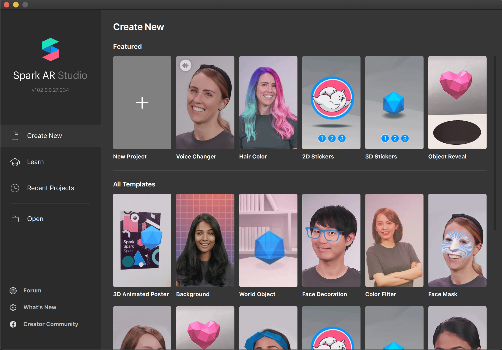
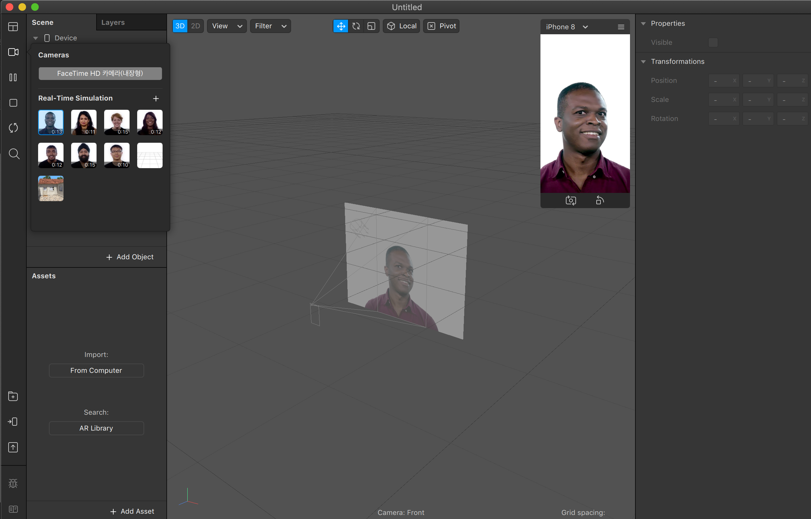
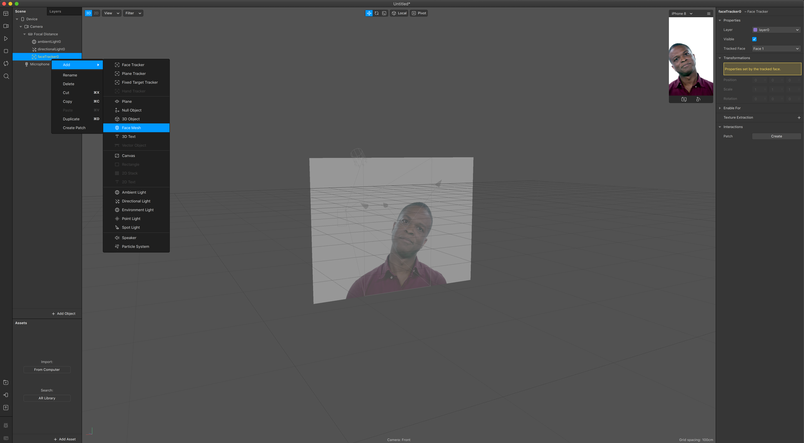
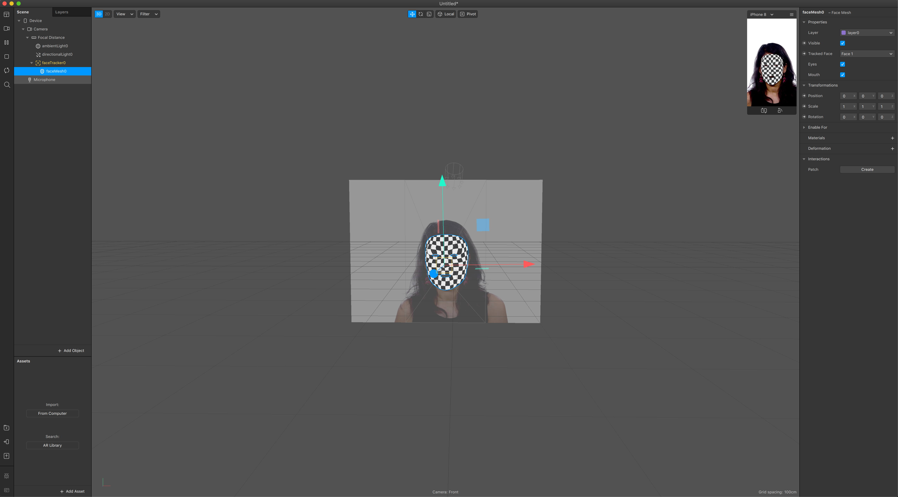
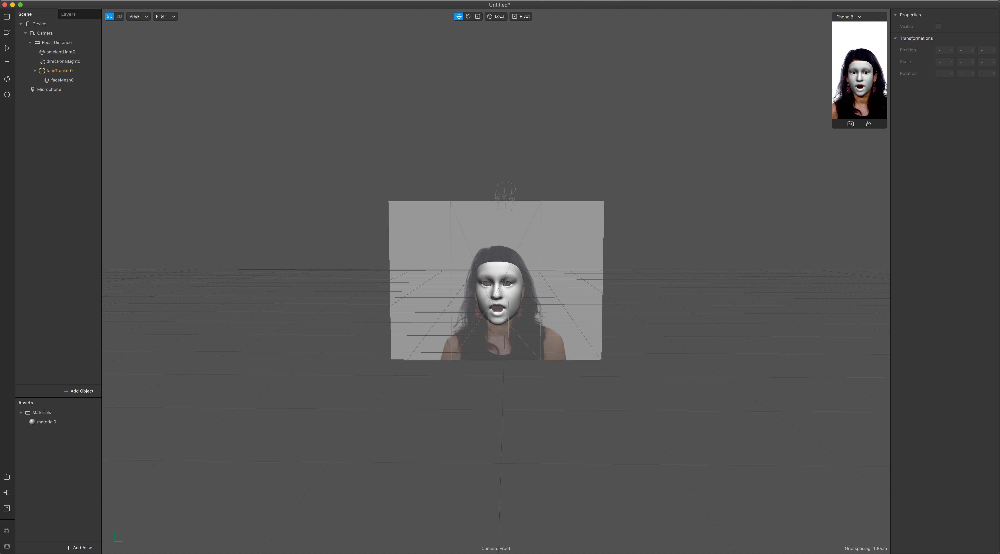
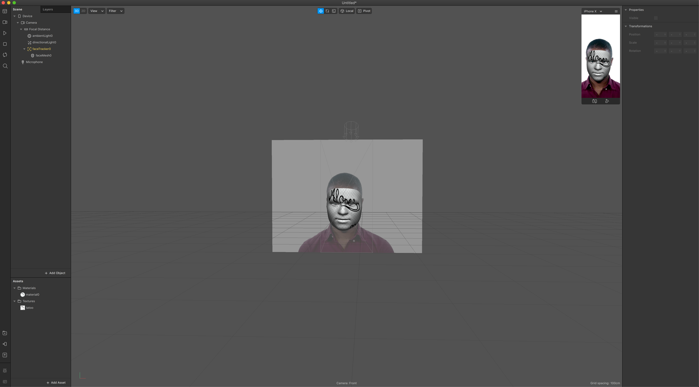
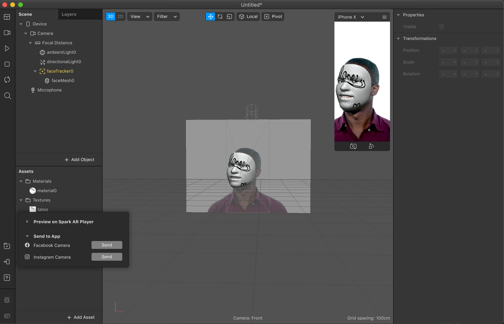

# SparkAR Tutorial #01

## Install

[SparkAR Download 링크](https://sparkar.facebook.com/ar-studio/download/)

## Tatoo Effect

### 프로젝트 시작하기

> 설치한 Spark AR을 시작한다.

> Blank, Voice, Hair Color, ... 여러 템플릿의 프로젝트를 선택하여 시작할 수 있다.
>
> -> 본 Tutorial에서는 Blank 템플릿 선택!

> Blank 템플릿을 선택하면, 다음과 같은 시작화면을 볼 수 있다.

### 카메라 선택

> 왼쪽 상단의 메뉴 중, 2번째 위치한 카메라 버튼을 통해서 테스트할 인물 선택이 가능하다.
>
> 다양한 인종 선택이 가능하며, FaceTime HD 카메라를 통해 노트북에 내장된 카메라 사용이 가능하다.

### FaceTracker 추가하기

> 기본적으로 제공되는 tracker를 이용하여, 카메라에 표출되는 인물의 얼굴 추적할 수 있다.

방법 1)
- Scene -> Device -> Camera -> Focal Distance
- Focal Distance를 우클릭 -> Add -> Face Tracker 추가

방법 2)
- Scene 하단 -> + Add Object 클릭
- FaceTracker 검색하여 추가

> 위의 방법으로 추가한 FaceTracker를 통해 인물의 얼굴 추적이 가능하다.
>
> Scene에 추가된 FaceTracker를 클릭하면, 얼굴의 중심을 오브젝트로 인식하는 것을 확인할 수 있다.

### FaceMesh 추가하기

> FaceMesh의 경우, FaceTracker의 하위 오브젝트로 추가가 가능하다.
>
> FaceTracker로 추적된 인물의 얼굴에 표면(면)을 오브젝트로 인식하여 표현이 가능하다.

방법)
- Scene에 추가된 faceTracker 선택
- faceTracker 우클 -> Add -> Face Mesh 선택

> 위의 방법을 통해 Face Mesh를 추가할 수 있다.
>
> FaceMesh가 정상적으로 추가된 경우, FaceTracker로 추적된 인물의 얼굴 위에 FaceMesh 오브젝트가 올라간 것을 확인할 수 있다.

### Material 추가하기

> 지금까지 FaceTracker와 FaceMesh를 추가했다면, 오브젝트로 인식된 FaceMesh 위에 사용자가 임의로 Material을 추가할 수 있다.

방법)
- Scene 메뉴 -> Device -> Camera -> Focal Distance
- Focal Distance에 지금까지 추가했던 faceTracker -> faceMesh를 선택
- faceMesh 선택 시, 우측 메뉴에서 Material 속성의 "+" 클릭
- 왼쪽 하단의 Assets에 새롭게 Material이 추가된 것을 확인 할 수 있다.

### material에 이미지(타투) 추가하기

> 위의 단계를 통해서 Material까지 추가하였다면, 이미 추가한 Material에 이미지(타투)를 추가하여 텍스처 표현이 가능하다.

방법)
- 왼쪽 하단의 Assets 메뉴 -> 이전에 추가한 material 클릭하여 선택
- 선택한 material의 우측에 존재하는 속성 메뉴로 이동
- Shader Properties의 Texture의 원하는 이미지 추가

> 위의 방법을 통해서 faceMesh에 원하는 이미지 추가가 가능하다.

### App에서 테스트하기!

> 위의 과정을 통해서 SparkAR 콘텐츠를 제작하였다면, 실제 디바이스의 Instagram 애플리케이션을 통해서 테스트가 가능하다.

방법)
- 맨 왼쪽 하단의 2번째 아이콘(Test on Device) 클릭
- Send to App
- Instagram Camera -> "Send" 버튼 클릭
- 자신의 Device의 인스타그램 애플리케이션의 알림 확인
- 테스트 콘텐츠를 실행하여 확인 가능

